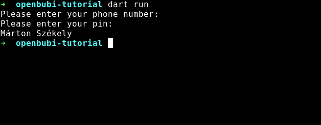

# <p align="center">Overview of the Dart package</p>

There you can find a simple guide for using the package.

There are two classes: `BubiUser`, and `BubiMap`. In this tutorial, I'll use these classes.

First of all, make a new Dart app. To achieve this, run `dart create -t console-full openbubi-tutorial`, and go to that folder (`cd openbubi-tutorial`).

Then go to the `lib` folder

```bash
cd lib
```

, and download `openbubi.dart` there.

```bash
wget https://raw.githubusercontent.com/PiciAkk/OpenBubi-Dart/main/app/lib/openbubi.dart
```

Then go back to the bin folder

```bash
cd ../bin/
```

And clear all the code from `cli.dart`.

Now you can start editing your first OpenBubi-Dart program.

**1.)** Import the package

```dart
import 'package:openbubi_tutorial/openbubi.dart' as openbubi;
```

**2.)** Make a new instance of the `BubiUser`, and the `BubiMap` class

```dart
// making a BubiUser instance (this takes two arguments)
openbubi.BubiUser testUser = new openbubi.BubiUser("phoneNumber", "pin");
// Making a BubiMap instance (this takes no argument)
openbubi.BubiMap testMap = new openbubi.BubiMap();
```

**3.)** Print the name of the `testUser` user

```dart
print(await testUser.getScreenName());
```

**4.)** With these simple steps, we can make a program that takes a phone number, a pin, and prints out a name

```dart
import 'package:openbubi_tutorial/openbubi.dart' as openbubi;
import 'dart:io';

void main() async {
  stdin.echoMode = false;
  stdout.write('Please enter your phone number: ');
  var phoneNumber = await stdin.readLineSync(); // we need the await keyword because this is an async function
  stdout.write('\nPlease enter your pin: ');
  var pin = await stdin.readLineSync(); // we need the await keyword because this is an async function

  var user = await openbubi.BubiUser(phoneNumber ?? "", pin ?? ""); // provide empty string if input is empty
  stdout.write("\n${await user.getScreenName()}\n");
}
```

**5.)** Run the program

```bash
dart run
```

Output:



Congratulations! You've made your first OpenBubi program! 🎉

You can read a more technical documentation about the built-in functions [here](../functions).
