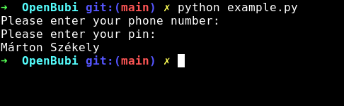

# <p align="center">Overview of the Python module</p>

There you can find a simple guide for using the module.

There are two classes: `BubiUser`, and `BubiMap`. In this tutorial, I'll use these classes.

First of all, make a new Python script, that is in the same directory as openbubi.py

Then import the module

```python
import openbubi
```

Then make a new instance of the `BubiUser`, and the `BubiMap` class

```python
# making a BubiUser instance (this takes two arguments)
testUser = openbubi.BubiUser("phoneNumber", "pin")
# Making a BubiMap instance (this takes no argument)
testMap = openbubi.BubiMap()
```

Then print the name of the `testUser` user

```python
print(testUser.getScreenName())
```

With these simple steps, we can make a program that takes a phone number, a pin, and prints out a name

```python
import openbubi
import getpass

phoneNumber = getpass.getpass("Please enter your phone number: ")
pin = getpass.getpass("Please enter your pin: ")

user = openbubi.BubiUser(phoneNumber, pin)
print(user.getScreenName())
```

Run the program

Output:



Congratulations! You've made your first OpenBubi program! 🎉

You can read a more technical documentation about the built-in functions [here](../functions).
